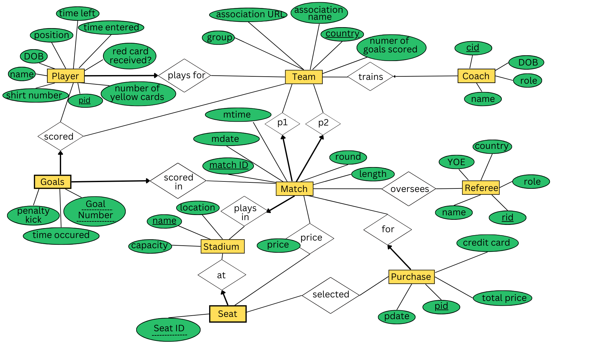

# World Cup Database Management

## OBJECTIVES
- Designed and implemented an ER schema and DB2 database infrastructure to manage and organize
data for a World Cup tournament
- Wrote SQL queries to retrieve specific data points such as match results, player statistics, tickets sold, etc.
- Developed an user-friendly Java application enabling users to input data into the database and access
comprehensive statistics and insights regarding the tournament

## LANGUAGE
- SQL
- Java 

## ER schema

  

